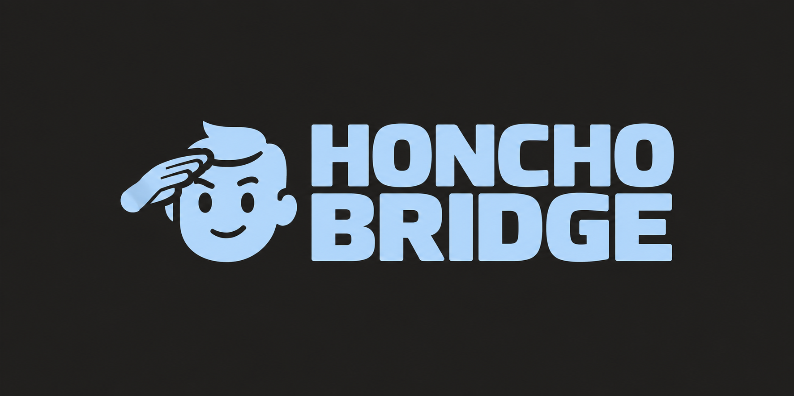
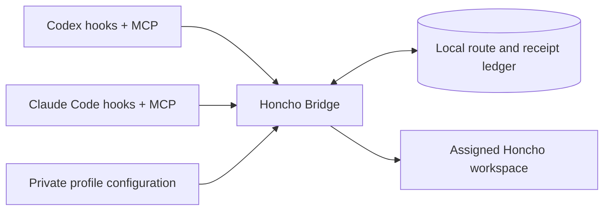

<p align="center">
  
</p>

<h1 align="center">Honcho Bridge</h1>
<p align="center"><strong>Shared memory. Separate contexts.</strong><br>Connect Codex and Claude Code to Honcho with explicit project routing.</p>
<p align="center">
  <a href="INSTALL.md">Install</a> ·
  <a href="docs/configuration.md">Configure</a> ·
  <a href="skills/honcho-setup/SKILL.md">LLM setup skill</a> ·
  <a href="CONTRIBUTING.md">Contribute</a>
</p>

Honcho Bridge gives your coding assistants access to the same user memory while
keeping unrelated projects in their assigned workspaces. A private configuration
file chooses the account, workspace, user peer, credentials, and local paths.
No daemon, per-project MCP server, or hardcoded personal identity is required.

**Early source release.** Install from a checkout on Linux or macOS with Node 24+
and Python 3.11+. The installer configures **both** Codex and Claude Code. There
is no published npm installer or standalone `honcho-bridge` command yet. This is
an independent community project, not an official Honcho, OpenAI, or Anthropic product.

## What it does

- **One destination per conversation.** Routes stay fixed when you resume a chat
  or change directories. Start a new conversation to switch memory areas.
- **Project-aware routing.** Directory rules, registered Git remotes, and shared
  Git directories identify repositories and worktrees. Conflicting rules stop access.
- **Shared user memory across clients.** Codex and Claude use the profile's user
  peer and retain distinct assistant peers.
- **Visible delivery state.** Public conversation messages are captured locally;
  pending and uncertain writes remain visible. Receipt checks prevent blind retries.
- **Configuration you own.** Identity, credentials, state, routing, and client paths
  live outside the checkout. Installation supports a preview, backups, and rollback.



## Get started

Clone into a directory you can keep: installed clients point to this checkout.

```sh
git clone https://github.com/erhuz/honcho-bridge.git
cd honcho-bridge
python3 -m venv .venv
. .venv/bin/activate
python3 -m pip install -r requirements.txt
npm ci --ignore-scripts
npm run check
```

Then follow the [installation guide](INSTALL.md) to create your private registry
and credential file, preview client changes, and verify a paused installation
before enabling uploads. For assisted setup, give your LLM
[`skills/honcho-setup/SKILL.md`](skills/honcho-setup/SKILL.md).

Already configured? Read [upgrading and rollback](INSTALL.md#upgrading-and-rollback).
The [configuration reference](docs/configuration.md) covers multiple profiles,
custom client locations, and legacy recovery paths.

## Know where your data goes

The bridge sends captured **public user and assistant messages** to the configured
Honcho endpoint when uploads are enabled. Private reasoning, tool output, and
recognized injected instructions are excluded. Redaction is best effort; avoid
putting secrets in conversation text. The local SQLite ledger also holds private
conversation data, and `pause` stops uploads while local capture continues.

New ledgers start paused. Every MCP tool call requires the route ID supplied by
the current conversation hook. A missing credential or changed profile identity
stops that area's access; the bridge does not switch accounts to recover.

This is a single-OS-user tool. Route IDs prevent accidental selection errors;
they are not authorization tokens against other processes running as your user.
Read the [security model and reporting policy](SECURITY.md).

## Daily use

Run from the checkout with the same registry used by your clients:

```sh
node src/cli.mjs --config ~/.config/honcho/profiles.json status
node src/cli.mjs --config ~/.config/honcho/profiles.json resolve ~/repos/my-project
node src/cli.mjs --config ~/.config/honcho/profiles.json pause
node src/cli.mjs --config ~/.config/honcho/profiles.json enable
```

`doctor` reads the configured Honcho workspaces. `flush` retries eligible pending
messages and checks uncertain receipts. Historical `inventory` and `recover` are
separate maintenance operations, not part of normal setup.

## Project status

The current source release includes the shared runtime, 16 MCP tools, client hooks,
configurable routing, and a Python installer. The [CI workflow](.github/workflows/ci.yml)
is configured to test Linux/macOS with Node 24/26; check
[actual workflow runs](https://github.com/erhuz/honcho-bridge/actions/workflows/ci.yml)
for results. Local tests do not certify a particular desktop client version.

A packaged Node-only installer, configuration commands, and schema v2 are
**planned**, not available. [PLAN.md](PLAN.md) and [SPEC.md](SPEC.md) describe that
future work. [Release preparation](docs/releasing.md) lists the remaining checks
before tagging an alpha.

Bug reports and contributions are welcome. Include versions and sanitized
reproduction steps; never attach keys, transcripts, or ledger files.
See [CONTRIBUTING.md](CONTRIBUTING.md).

## License and attribution

Original code is [MIT licensed](LICENSE). The vendored Claude Honcho adapter is
copyright Plastic Labs and retains its [MIT license](vendor/claude/LICENSE) and
[source provenance](vendor/claude/PROVENANCE.json).
See [third-party notices](THIRD_PARTY_NOTICES.md).
